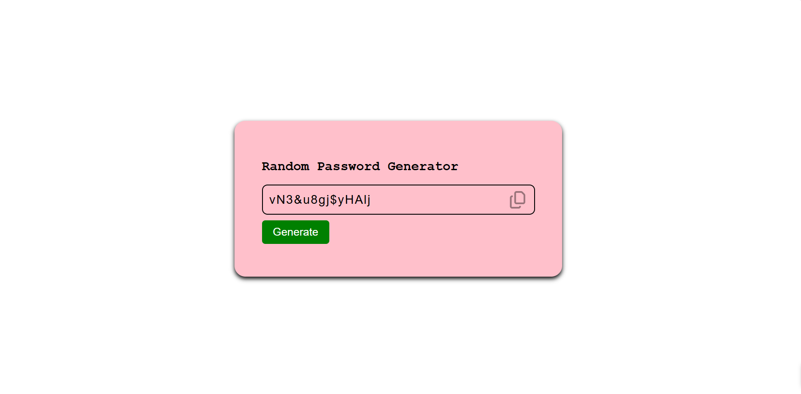

# 🔐 Random Password Generator

A simple **Random Password Generator** made using **HTML, CSS, and JavaScript**.  
It generates a strong random password and allows users to copy it instantly.

---

## ✨ Features

✅ Generates random password (length: 14)  
✅ Includes lowercase + uppercase + numbers + symbols  
✅ One-click copy to clipboard  
✅ Shows alert message after copying  
✅ Clean and simple UI  

---

## 🛠️ Tech Stack

- HTML  
- CSS  
- JavaScript  

---

## 📂 Project Files

- `index.html`  
- `style.css`  
- `index.js`  

---

## 🚀 How to Run

1. Download / Clone this repository  
2. Open the folder  
3. Run the project by opening `index.html` in your browser  

---

## 🖼️ Output / Preview

- Click **Generate** → password is created  
- Click **Copy icon** → password is copied and alert appears  

This is how the webpage looks:

(screenshots/output3.png.png)

---

## 📚 What I Learned From This Project

✅ Connecting HTML, CSS, and JavaScript in one project  
✅ DOM Selection using `querySelector()` and `getElementById()`  
✅ Handling click events using `addEventListener()`  
✅ Generating random characters using `Math.random()` and `Math.floor()`  
✅ Creating passwords using loops and string manipulation  
✅ Copying text to clipboard using `navigator.clipboard.writeText()`  
✅ Showing/hiding alert messages using CSS classes + `setTimeout()`  
✅ Styling UI with CSS (hover effects, layout, borders, etc.)

---

## 🔹 Author
**Sayna21**

